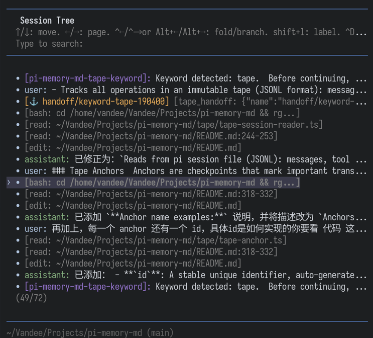

# pi-memory-md

Letta-like memory management for [pi](https://github.com/badlogic/pi-mono) using Git-backed markdown files.

## Features

- **Persistent Memory**: Store context, preferences, and knowledge across sessions
- **Git-backed**: Version control with full history
- **Prompt append**: Memory index automatically appended to conversation at session start
- **On-demand access**: LLM reads full content via tools when needed
- **Multi-project**: Separate memory spaces per project

## Quick Start

```bash
# 1. Install
pi install npm:pi-memory-md
# Or for latest from GitHub:
pi install git:github.com/VandeeFeng/pi-memory-md

# 2. Create a GitHub repository (private recommended)

# 3. Configure pi
# Add to ~/.pi/agent/settings.json:
{
  "pi-memory-md": {
    "repoUrl": "git@github.com:username/repo.git", // or HTTPS format
    "localPath": "~/.pi/memory-md"
  }
}

# 4. Start a new pi session
# type /memory-init slash command to initialize the memory files
```

## How It Works

```
Session Start
    ↓
1. Git pull (sync latest changes)
    ↓
2. Scan all .md files in memory directory
    ↓
3. Build index (descriptions + tags only - NOT full content)
    ↓
4. Inject memory index via `message-append` or `system-prompt`
    ↓
5. LLM reads full file content via tools when needed
```

## Slash Commands In Pi

You can also use these slash commands directly in pi:

| Command | Description |
|---------|-------------|
| `/memory-init` | Initialize memory repository (clone repo, create directory structure, generate default files) |
| `/memory-status` | Show memory repository status (project name, git status, path) |
| `/memory-refresh` | Refresh memory context from files (rebuild cache and inject into current session) |
| `/memory-check` | Check memory folder structure (display directory tree) |

## Available Tools

The LLM can use these tools to interact with memory:

### Memory Management Tools

| Tool | Parameters | Description |
|------|------------|-------------|
| `memory_init` | `{force?: boolean}` | Initialize or reinitialize repository |
| `memory_sync` | `{action: "pull" / "push" / "status"}` | Git operations |
| `memory_read` | `{path: string}` | Read a memory file |
| `memory_write` | `{path, content, description, tags?}` | Create/update memory file |
| `memory_list` | `{directory?: string}` | List all memory files |
| `memory_search` | `{query?, grep?, rg?}` | Search by tags/description and custom grep/ripgrep patterns |
| `memory_check` | `{}` | Check current project memory folder structure |

## Memory File Format

```markdown
---
description: "User identity and background"
tags: ["user", "identity"]
created: "2026-02-14"
updated: "2026-02-14"
---

# Your Content Here

Markdown content...
```

## Directory Structure

```
~/.pi/memory-md/
└── project-name/
    ├── core/
    │   ├── user/           # Your preferences
    │   │   ├── identity.md
    │   │   └── prefer.md
    │   └── project/        # Project context
    │       └── tech-stack.md
    └── reference/          # On-demand docs
```

## Configuration

```json
{
  "pi-memory-md": {
    // "enabled": false,
    "repoUrl": "git@github.com:username/repo.git", // Or HTTPS format
    "injection": "message-append",
    "hooks": {
      "sessionStart": ["pull"],
      "sessionEnd": ["push"]
    }
  }
}
```

| Setting | Default | Description |
|---------|---------|-------------|
| `enabled` | `true` | Enable extension |
| `repoUrl` | Required | GitHub repository URL |
| `localPath` | `~/.pi/memory-md` | Local clone path |
| `injection` | `"message-append"` | Memory injection mode: `"message-append"`, `"system-prompt"` |
| `hooks.sessionStart` | `["pull"]` | Actions to run when a session starts |
| `hooks.sessionEnd` | `[]` | Actions to run when a session ends |
| `tape.enabled` | `false` | Enable tape mode for dynamic context selection |

When settings change, run `/reload` to apply them.

### Hooks

- `sessionStart: ["pull"]`: pull latest memory before the first prompt.
- `sessionEnd: ["push"]`: commit and push memory when the session ends.

Legacy config is still supported:

```json
{
  "autoSync": {
    "onSessionStart": true
  }
}
```

But it is recommended to migrate to the new `hooks` config.

More trigger actions can be added later, even custom hooks.

### Memory Injection Modes

The extension supports two base modes for injecting memory into the conversation.
When tape mode is disabled, behavior is exactly as described below.
When tape mode is enabled, the same delivery mode still applies, but tape changes how memory files are selected.

#### 1. Message Append (Default)

```json
{
  "pi-memory-md": {
    ...
    "injection": "message-append"
  }
}
```

- Memory is sent as a custom message before the user's first message
- Not visible in the TUI (`display: false` in pi-tui)
- Persists in the session history
- Injected only once per session (on first agent turn)
- **Pros**: Lower token usage, memory persists naturally in conversation
- **Cons**: Only visible when the model scrolls back to earlier messages

#### 2. System Prompt

```json
{
  "pi-memory-md": {
    ...
    "injection": "system-prompt"
  }
}
```

- Memory is appended to the system prompt
- Rebuilt and injected on every agent turn
- Always visible to the model in the system context
- **Pros**: Memory always present in system context, no need to scroll back
- **Cons**: Higher token usage (repeated on every prompt)

## Usage Examples

Simply talk to pi - the LLM will automatically use memory tools when appropriate:

```
You: Save my preference for 2-space indentation in TypeScript files to memory.

Pi: [Uses memory_write tool to save your preference]
```

You can also explicitly request operations:

```
You: List all memory files for this project.
You: Search memory for "typescript" preferences.
You: Read core/user/identity.md
You: Sync my changes to the repository.
```

The LLM automatically:
- Reads memory index at session start (appended to conversation)
- Writes new information when you ask to remember something
- Syncs changes when needed

## Tape Mode (Dynamic Context Injection)

> **Experimental**: This mode is under active development. APIs and behavior may change.
>
> For the latest, install via GitHub: `pi install git:github.com/VandeeFeng/pi-memory-md`
>
> **Note**: This mode may consume more tokens. Adjust parameters based on your model's context window and your API quota.

More details [tape-design](docs/tape-design.md) / [中文版](docs/tape-design.zh.md)

Minimal setting:

```json
{
  "pi-memory-md": {
    ...
    "tape": {
      // "enabled": false,
      "anchor": {
        "keywords": {
          "global": ["refactor", "migration"],
          "project": ["tape", "Emacs"]
        }
      }
    }
  }
}
```
Then use `/memory-anchor` to create an anchor manually, or let anchors be created automatically when configured keywords are triggered.

If you want to jump to the conversation around an anchor and restart from there, `/tree` and the anchors in this session are all there with a customizable anchor label in pi TUI.

### Tape vs Injection Modes

**Tape** is an independent feature that can be enabled alongside either injection mode.
It does not change the delivery mechanism; it changes **which memory files** are selected.

| Tape | Injection mode | Behavior |
|------|----------------|----------|
| Disabled | `message-append` | Sends memory once as a hidden custom message on the first agent turn |
| Disabled | `system-prompt` | Rebuilds memory and appends it to the system prompt on every agent turn |
| Enabled | `message-append` | Sends tape-selected memory once as a hidden custom message on the first agent turn |
| Enabled | `system-prompt` | Rebuilds tape-selected memory and appends it to the system prompt on every agent turn |

With tape enabled, the injected content is still a memory index/summary for the model, but the file list is chosen by tape-aware selection logic instead of the basic project scan. In smart mode, the injected list can also include recently active project file paths inferred from tool usage, plus a `recent focus` summary for each selected file showing the most recently attended `read` / `edit` ranges inside the same effective smart-scan window. Stale paths from old tape history are ignored when the file no longer exists.

Tape follows an opt-out rule: if a `tape` block exists, tape is on unless you set `"enabled": false`.

A tape hidden message injected looks like this:

```md
# Project Memory

Memory directory: /home/user/.pi/memory-md/my-project

Paths below are relative to that directory.

Available memory files (use memory_read to view full content):

- core/user/identity.md [high priority]
  recent focus: read 12-28
  Description: User preferences and identity
  Tags: user, profile

---

Recently active project files (full paths from read/edit/write tool usage):

- /path/to/project/tape/tape-selector.ts [high priority]
  recent focus: read 340-420, read 590-677, edit 340-399

---
💡 Tape is enabled for this conversation. Use tape tools when you need anchors or tape history.
```

Tape also:
- Uses pi session entries as the source of truth, with anchors attached directly to points in the session
- **Anchor-based context**: Selects relevant memory files and recently active project files based on recent usage and configured strategy
- **Recent focus hints**: Selected files can include concise `recent focus` ranges such as `read 340-420` or `edit 390-399`
- Creates `session/*` lifecycle anchors automatically and `handoff` anchors via `tape_handoff` or `/memory-anchor`
- Supports `anchor.mode: "manual"` to hard-block direct `tape_handoff`; keyword-matched hidden instructions and `/memory-anchor` still authorize handoff creation
- Keyword detection can send a hidden message that guides the agent to create a keyword anchor, while still allowing the agent to refuse when such an anchor is unnecessary
- Mirrors anchor names into pi `/tree` labels for the anchored session nodes, with full label cleanup before resync to avoid stale labels
- **Pros**: Better context selection with checkpoint management, recent project file awareness, and handoff-aware prioritization
- **Cons**: Slightly more complex configuration and more token costs

### Config Guide

```json
{
  "pi-memory-md": {
    ...
    "localPath": "~/.pi/memory-md",
    "tape": {
      // Run tape only inside a Git repository by default
      // Without .git, tape inject and anchors are skipped
      "onlyGit": true, // default

      // Absolute directory paths where tape is always disabled
      // Built-in system/temp directories are also excluded by default
      "excludeDirs": [
        "/absolute/path/to/sandbox"
      ],

      "context": {
        // "smart": ranks memory files plus recent project file activity from session history (default)
        //          repeated accesses get diminishing returns, edit/write outrank plain reads,
        //          recent accesses get a recency bonus, missing/stale paths are ignored,
        //          and handoff boosts only apply near the latest anchors
        // "recent-only": most recently modified memory files only
        "strategy": "smart", // default

        // Max files to inject into LLM context
        "fileLimit": 10, // default

        // Smart-mode pi session history scan range: [startHours, maxHours]
        // Scans history incrementally by 24-hour steps, starting from startHours.
        // Stops and uses the result once the sample reaches MIN_SMART_ACCESS_SAMPLES (5).
        // Otherwise keeps expanding until maxHours is reached.
        "memoryScan": [72, 168], // default

        // "alwaysInclude" is deprecated
        // Files or directories to always include in context (optional, defaults to empty)
        "whitelist": [
          "core/user",
          "docs/tape-design.md"
        ],

        // Files or directories to always exclude from context (optional, defaults to empty)
        // Other paths still go through rg ignore rules first, then the built-in default ignore list.
        "blacklist": [
          "node_modules",
          "dist"
        ]
      },
      "anchor": {
        // "auto": LLM may create handoff anchors when it decides they are useful
        // "manual": direct tape_handoff is hard-blocked
        // hidden keyword instructions and /memory-anchor still work in manual mode
        "mode": "auto", // default

        // Prefix mirrored into pi /tree labels for anchor nodes
        "labelPrefix": "⚓ ", // default

        "keywords": {
          // Match against user prompts with length in [10, 300]
          // When matched, send a hidden instruction about the tape_handoff tool call
          // This gives the agent room to refuse when creating a keyword anchor is not necessary at all
          // Strongly recommended! Keywords make anchor creation much smarter - customize based on your focus areas
          "global": ["refactor", "migration"],
          "project": ["tape", "Emacs"]
        }
      },

      // Custom tape path (optional)
      // If not set, default is {localPath}/TAPE: ~/.pi/memory-md/TAPE
      // Anchor index files (.jsonl) will be stored directly under this path
      "tapePath": "/custom/path/to/tape"
    }
  }
}
```

### Tape Anchors

Anchors are named checkpoints that correspond to pi session entries, marking important transitions in your conversation. They enable efficient context reconstruction and are mirrored into pi `/tree` labels:



Each line in the tape anchor store is a JSON record:
```json
{"id":"1234567890-abc123","name":"task/begin","kind":"handoff","sessionId":"abc","sessionEntryId":"def","timestamp":"2026-04-04T12:00:00.000Z","meta":{"summary":"Working on feature X","trigger":"direct"}}
```

Each anchor has:
- **`id`**: A stable unique identifier, auto-generated from `sessionEntryId:timestamp:name`
- **`name`**: A human-readable label (e.g., `session/new`, `task/begin`)
- **`kind`**: Anchor type - `session` for lifecycle anchors, `handoff` for manual/semantic transitions
- **`sessionId`**: The pi session this anchor belongs to
- **`sessionEntryId`**: The associated session entry ID for tree mirroring
- **`timestamp`**: ISO timestamp of when the anchor was created
- **`meta`**: Optional metadata including `summary`, `trigger`, `keywords`, etc. `direct` means created by the agent automatically, `keyword` means created because configured keywords matched, and `manual` means created explicitly by the user or tool call

more details: https://tape.systems/

### Tape Tools (Anchor-based Context)

| Tool | Parameters | Description |
|------|------------|-------------|
| `/memory-anchor` | `<prompt>` | Slash command that asks the LLM to derive and create a manually authorized handoff anchor |
| `tape_handoff` | `{name, summary?, purpose?}` | Create a handoff anchor checkpoint in the tape |
| `tape_list` | `{limit?: number}` | List all anchor checkpoints |
| `tape_delete` | `{id}` | Delete an anchor checkpoint by id |
| `tape_info` | `{}` | Get tape statistics and information |
| `tape_search` | `{query?, kinds?, limit?, sinceAnchor?, anchorName?, anchorKind?, anchorSummary?, anchorPurpose?, anchorKeywords?}` | Search tape entries by text or kind, with structured anchor-field filters |
| `tape_read` | `{afterAnchor?, lastAnchor?, betweenAnchors?, betweenDates?, query?, kinds?, limit?}` | Read tape entries as formatted messages |
| `tape_reset` | `{archive?: boolean}` | Reset the tape with a new session lifecycle anchor |

> **Note**: Tape tools are automatically registered when `tape` is set to `true`. They provide anchor-based context management inspired by [bub](https://bub.build)'s tape mechanism.

## Reference
- [Introducing Context Repositories: Git-based Memory for Coding Agents | Letta](https://www.letta.com/blog/context-repositories)
- https://tape.systems
- https://bub.build/
- https://github.com/bubbuild/bub/tree/main/src/bub

